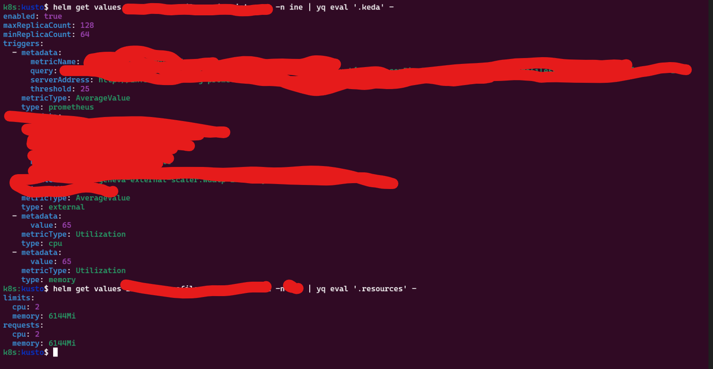

# Helm Release Values Extractor

This Python script extracts specific values from a Helm release's values YAML and presents the extracted data in a tabular format.



## Prerequisites

- Python 3.x
- `yaml` and `tabulate` Python libraries
- Helm

## Usage

1. Clone this repository to your local machine.

2. Install the required Python libraries using the following command:

   ```bash
   pip install pyyaml tabulate
# helm-cheat-sheet
